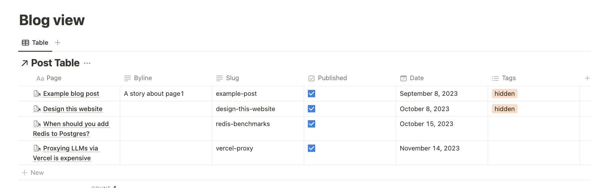

# Next.js Notion Blog CMS

This template helps you set up a blog using Notion as a CMS. Powered by the [t3 stack](https://create.t3.gg/), [react-notion-x](https://github.com/NotionX/react-notion-x) and the [official Notion API](https://developers.notion.com/).

I built this to power [my blog](https://www.venki.dev), because I enjoy writing in Notion, and don't want to have to port posts to another CMS when I'm done. This might be the right example to follow if you want to include a blog in your website, but otherwise want to build the website in React. 

This repo is a fairly minimal example of using the Notion API + react-notion-x + a Notion table to store a post list. You can probably integrate this into an existing website as a blog example.

## Other options for Notion-based blogs

I tried a few other options before deciding to go ahead with this approach, that you should consider instead of this template:

[Potion.so](https://potion.so/) and [Super.so](https://super.so/): Paid options to help you host a website using Notion as a CMS.

[nextjs-notion-starter-kit](https://github.com/transitive-bullshit/nextjs-notion-starter-kit): A similar starter kit for building a website using Notion - it focuses a little more on the _whole_ website being in Notion.

### How to decide

- You want to build a website, where the content lives in Notion. You want nice themes & templates built for you, and you don't anticipate needing to build complex logic outside of Notion: **Use Potion or Super**

- You want to build a personal website / blog where all the website's content is in the form of a nested Notion page: **Use nextjs-notion-starter-kit**. See [transitivebullshit's blog](https://transitivebullsh.it/) for an example.
    - (You can also probably modify this in plenty of ways to add more complex logic!) 

- You want to build a website, where blog content lives in Notion. You want to build complex logic outside of Notion, and also want to handle unpublished posts, tags, etc in a custom non-notion manner: **Use this template**. 

In general, the other options lean _more_ into Notion's style - often making published posts look Notion-y, and directly displaying Notion collection views. This repo leans much _less_ into it - just using Notion as a replacement for a directory full of .mdx files.

### Advantages of this template

These are the reasons why I set out to build my blog in this manner instead of using other options for Notion.CMS:

- I wanted to build a view inside Notion to hold unpublished posts, tags, and other metadata that I might display alongside a post - info not by default shown by Notion. 

- I didn't like having to leave Notion, and "add a new post" in Potion.so or Super.so UI

- I don't want to build the homepage of my website in Notion (a la nextjs-notion-starter-kit)

- I expect to want to write a lot of custom Next.js code, eg: build theme pickers, occasionally include interactive blogposts, demos of projects etc

## Setup

- Clone this repo
- `npm install`
- Copy `.env.example` to `env` and add your Notion API key and database ID (see below)
- `npm run dev` to start the dev server

### Setting up your Notion API Key & Database ID

- Duplicate [this template](https://fern-war-b40.notion.site/Blog-template-1f9483c1dcf34e33bb2c9e46d90f950a?pvs=4). It contains a `Post table` to act as the top level view of posts & their state, and a `Posts` page, where you can store your posts
- Navigate to the `Post table` and copy its ID from the URL, eg if your URL is `https://www.notion.so/FOOBARBAZ?v=BALBAMBAN` then your ID is `FOOBARBAZ` - this is your `NOTION_DATABASE_ID`
- Navigate to your [Notion integrations page](https://www.notion.so/my-integrations) and create a new integration. Copy the secret key - this is your `NOTION_API_KEY`
- Add the integration to your top level "Blog template" page

### Deployment

I personally use [fly.io](https://fly.io), but Vercel is the more popular alternative you can use insted.

With `fly.io`, install the fly CLI, and then run `fly launch` to create an app and deploy.

## How does this work?

The Post table contains a list of posts & associated metadata, and the official Notion API is used to retrieve them. Results are cached in .cache for 30s, to reduce API usage. This logic mostly lives in `utils/notion.ts`

Each post is rendered by `react-notion-x`, you can see its invocation in `components/blog_post.tsx`.

